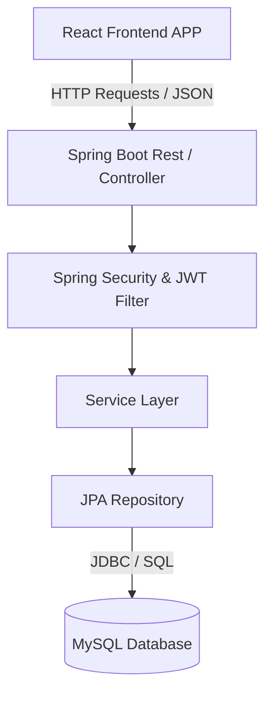

# Project Design Documentation: Student Management System

## 1. System Architecture
The application follows a classic Three-Tier architecture, structured as a decoupled Single Page Application (SPA).
* **Presentation Tier:** React frontend application running in the user's browser.
* **Logic/Application Tier:** Spring Boot backend serving as an API Server.
* **Data Tier:** MySQL Relational Database.

## 2. Backend Design (Spring Boot)

The backend code is organized into established domain-driven packages inside `com.sms.Student`.

### 2.1 Component Layers
1. **Controllers (`/controller`):**
   * Acts as the entry point for HTTP requests.
   * `AuthController.java`: Handles `/api/auth/register` and `/api/auth/login`. Returns JWT tokens upon successful authentication.
   * `StudentController.java`: A secured REST controller handling CRUD operations on the `/api/students` endpoints.
2. **Services (`/service`):**
   * Contains core business logic so controllers remain thin.
   * `StudentService`: Manages adding, querying, updating, and deleting students.
   * `UserDetailsServiceImpl`: Integrated with Spring Security to load user details from the database.
3. **Security (`/security`):**
   * Configuration for Stateless JWT authentication.
   * Disables CSRF (typical for SPA + JWT).
   * Defines filters (`AuthTokenFilter`) that intercept HTTP requests to validate JWTs in the `Authorization: Bearer <token>` header.
4. **Data Access (`/repository`):**
   * Interfaces extending `JpaRepository`.
   * Abstracts all boilerplate SQL queries (e.g., `UserRepository.existsByUsername()`).
5. **Data Models & DTOs (`/model`, `/dto`):**
   * **Models**: `User`, `Student`. Represent DB entities.
   * **DTOs**: `LoginRequest`, `RegisterRequest`, `JwtResponse` used exclusively to transfer data cleanly over endpoints without exposing entire DB objects.

### 2.2 Security Flow
1. User provides `username` + `password` continuously to `/api/auth/login`.
2. Backend authenticates via `AuthenticationManager`.
3. If successful, `JwtUtils` generates a cryptographically signed Token containing standard claims plus `UserDetails`.
4. Token returned to the React frontend.
5. React includes this Token in all subsequent requests (via Axios interceptors or config).
6. Spring Security intercepts incoming calls to SECURED endpoints, delegates to `JwtUtils` to validate the token. If valid, the execution proceeds to the Controller.

---

## 3. Frontend Design (React + Vite)

The frontend uses a modern functional component architecture supported by React Hooks. 

### 3.1 Component & Routing Structure
* **`App.jsx`**: Configures `react-router-dom` to map URL paths to specific page components (e.g., `/login` to `<Login />`, `/register` to `<Register />`, etc.). Private routes wrap the dashboard to ensure users don't access it unauthenticated.
* **`/pages`**: Top-level route components containing specific business logic for the view (e.g., fetching initial load information).
* **`/components`**: Reusable generic layout or UI elements (Navbar, Modals, Forms, Buttons) that `pages` rely on.

### 3.2 State Management & Networking
* State is primarily handled via React primitives (`useState`, `useEffect`).
* Network logic is abstracted away into the `services/` directory.
* `services/api.js`: Likely exports a configured instance of Axios. This allows the centralized configuration of the `baseURL` (pointing to `localhost:8080/api`) and HTTP request interceptors that attach the JWT token retrieved from `localStorage` to all outgoing protected requests.

## 4. Database Schema
While abstracted by Hibernate (JPA), the logical schema boils down to:

**Table `user`**
| Field | Type | Description |
|-----------|-----------|----------------------------------|
| id | BIGINT (PK)| Auto-incremented primary key |
| username | VARCHAR | Unique handle |
| password | VARCHAR | BCrypt hashed password |
| role | VARCHAR | E.g., 'ADMIN' |

**Table `student`**
| Field | Type | Description |
|-----------|-----------|----------------------------------|
| id | BIGINT (PK)| Auto-incremented primary key |
| firstName | VARCHAR | |
| lastName | VARCHAR | |
| email | VARCHAR | |

*(Additional fields as needed by the application requirements.)*

## 5. Technical Decisions & Assumptions
1. **No External Role Management:** Everyone who registers is assigned "ADMIN". This simplifies MVP development significantly. Should roles diversify out in the future, a Role table and many-to-many relationship mappings will need to be introduced.
2. **Stateless Session:** Utilized JWT rather than cookies + Sessions for server scalability and ease of use moving between UI / API decoupled architecture.
3. **Vite vs CRA:** Chosen Vite for immediate HMR (Hot Module Replacement) and optimized bundling compared to the slower Create React App standard. 
